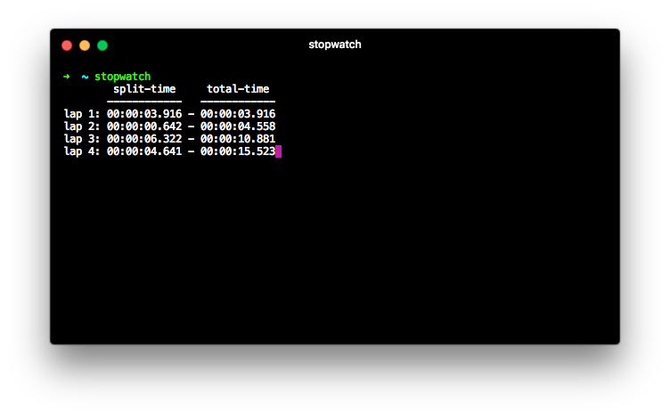

# Stopwatch

> Stopwatch is a simple time tracking cli app



- [Requirements](#requirements)
- [Installation](#installation)
- [Usage](#usage)
- [Testing](#testing)
- [License](#license)

## Requirements

- Python
  - version 2.7+ or 3.5+

## Installation

### With package manager

This method is *not available yet*.

### Manually

Download project as zip and unzip it,
&lt;OR&gt;,
clone the project with
`$ git clone https://github.com/matejkosiarcik/Stopwatch.git`.
Then run:

```sh
cd Stopwatch
pip install .
# If you do not have pip installed, try: $ python setup.py install
```

#### Alternative

If you dislike aforementioned forms of installation, you can just download
single script file `stopwatch` from releases and put it somewhere under your
`PATH`.

## Usage

Run the program `$ stopwatch`.

Controls:

Key | description
--- | ---
&lt;Enter&gt; | new lap
&lt;Space&gt; | pause/continue
&lt;ESC&gt; or &lt;Q&gt; | quit

If you are experiencing troubles, see help page with `$ stopwatch -h` or
`$ stopwatch --help`.

## Testing

To test project, run `$ python tests.py`.

Not all parts of the program are testable, so always make sure the program runs
correctly.

## License

This project is licensed under the MIT License,
see [LICENSE.txt](LICENSE.txt) file for full license details.
