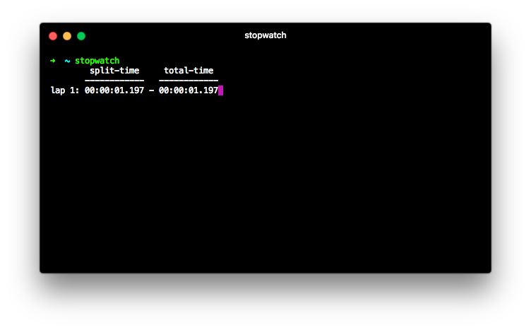
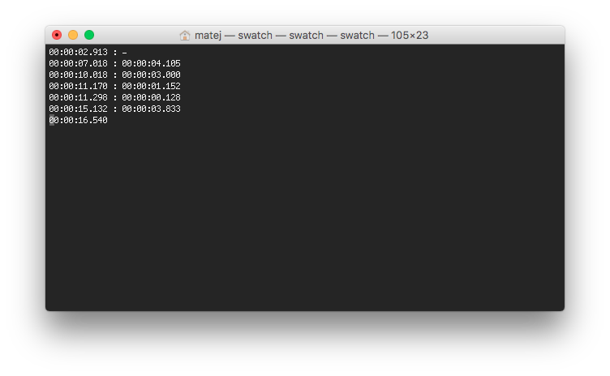

# Stopwatch

> Stopwatch is command line application and library for time tracking.



- [Requirements](#requirements)
- [Installation](#installation)
  - [Executable](#executable-installation)
  - [Library](#library-installation)
- [Usage](#usage)
  - [Executable](#executable-usage)
  - [Library](#library-usage)
- [Testing](#testing)
- [License](#license)

## Requirements

To **use**:

- macOS 10.9+

*Linux support is in the works*.

To **compile**:

- Swift 4.0+
- Xcode 9.0+ (optional)

## Installation

### Executable installation

#### Download release

Download precompiled binary file from releases tab.

#### Build from source

Clone the repository `$ git clone git@github.com:matejkosiarcik/Stopwatch.git`
or download repository manually as `.zip` file and unzip it.

Navigate to project root `$ cd Stopwatch` and run `$ swift build -c release`.
Your resulting binary can be found at `$ ./.build/release/swatch`.

### Library installation

#### Swift Package Manager

The [Swift Package Manager](https://swift.org/package-manager) is a tool for automating the distribution
of Swift code and is integrated into the `swift` compiler.

Add dependency entry to your `Package.swift` file:

``` swift
package.dependencies = [
    .package(url: "https://github.com/matejkosiarcik/Stopwatch.git", from: "0.1.0")
    // Your other dependencies
]
```

Then run `$ swift package update` to update your dependencies.

#### Manually

##### Download release

Download library file from releases tab.

##### Build from source

Clone the repository `$ git clone git@github.com:matejkosiarcik/Stopwatch.git`
or download repository manually as `.zip` file and unzip it.

Navigate to project root `$ cd Stopwatch` and
run `$ swift package generate-xcodeproj --xcconfig-overrides "Config/Settings.xcconfig"`.
You should see generated `Stopwatch.xcodeproj` in project root.
You now can:

- include it into other projects
- build the frameworks with `⌘ + B` and use the resulting library/framework `Stopwatch.framework`

## Usage

### Executable usage

Run the binary `$ ./swatch`.
App prints controls at start, e.g (`space` to pause).
Laps are reported in format: `(from first start) : (from last recorded lap)`, example:



If you are experiencing troubles, see help page with `$ ./swatch -h` or `$ ./swatch --help`.

### Library usage

Import library in your Swift or Objective-C code

``` swift
import Stopwatch
```

``` objc
@import Stopwatch;
```

The main type is `Timer`. Example usage:

``` swift
let timer = Stopwatch.Timer() // creates new timer
timer.start() // starts counting time
// ... later
timer.lap() // records current time-offset as new lap
// ... later
timer.stop() // works like a pause, timer can be restarted where it stopped
// ... later
timer.start() // restarts timer where we stopped
// ... later
print(timer.current) // prints current time from start
print(timer.laps) // prints recorded laps
```

## Testing

To test the swift part of project, just run ```$ swift test``` in project root.
To test whole project including swift, shell and other sources, run ```$ ./Utils/test``` in project root.

Not all parts of the app are testable, so always make sure the resulting executable runs correctly.

## License

This project is licensed under the MIT License,
see [LICENSE.txt](LICENSE.txt) file for full license details.
